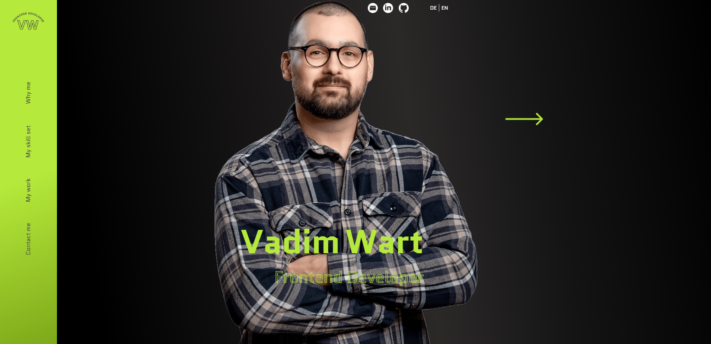
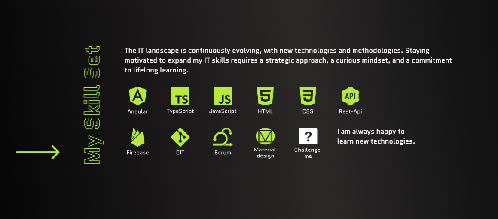
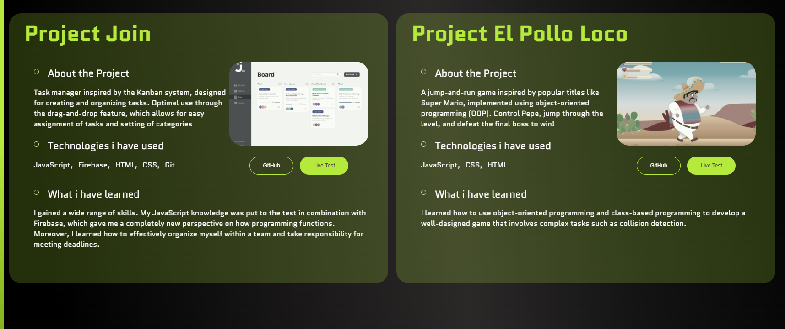

# Portfolio Project

Welcome to my personal portfolio! This is a modern, responsive, and interactive portfolio website built using **Angular 17.0.3**, **TypeScript**, **SCSS**, and **HTML**. It's designed to showcase my skills, projects, and professional background in a clean and user-friendly interface.

---

## 🛠️ Technologies Used

- **Frontend:**
  - Angular (Framework)
  - TypeScript (for type safety and better code structure)
  - SCSS (for styling and responsive design)
  - HTML5 (for structure and content)

- **Tools:**
  - Visual Studio Code (Code editor)
  - Git (Version control)
  - GitHub (Repository hosting)

---

## 🚀 Features

- **Responsive Design:** 
  - Fully responsive layout for both desktop and mobile devices.
  
- **About Me Section:** 
  - A brief introduction to who I am and what I do.
  
- **Project Showcase:**
  - Displays a variety of projects I have worked on, complete with descriptions and links to their repositories or live demos.
  
- **Skills Overview:**
  - Highlights the technical skills and tools I use in my development process.

- **Contact Form:**
  - Allows visitors to send messages directly through the portfolio.

- **Interactive Navbar:**
  - Smooth navigation between different sections of the website.

---
## 🌟 Screenshots

### Homepage

### Skills Section

### Project Section

---
## 📧 Contact

If you have any questions or would like to connect, feel free to reach out to me:

- **Email**: [your.email@example.com](mailto:contact@vadim-wart.com)
- **LinkedIn**: [Your LinkedIn](https://www.linkedin.com/in/vadim-wart-a4564a32a)
- **GitHub**: [Your GitHub](https://github.com/VadimWart)

I'm always happy to discuss new opportunities, collaborations, or just connect with like-minded professionals! 😊

